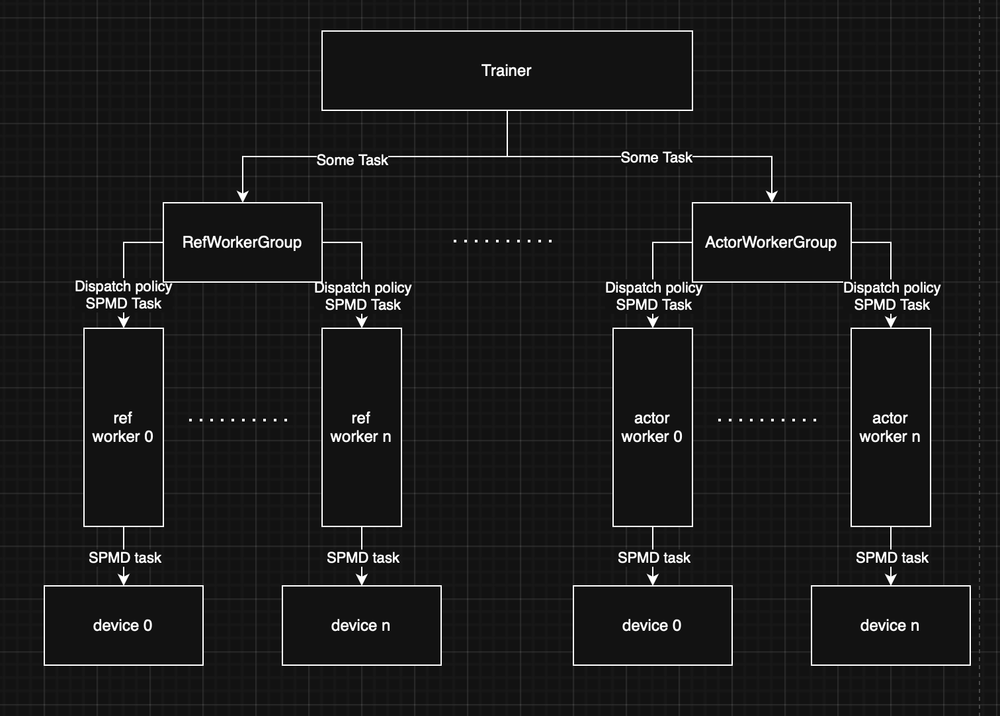
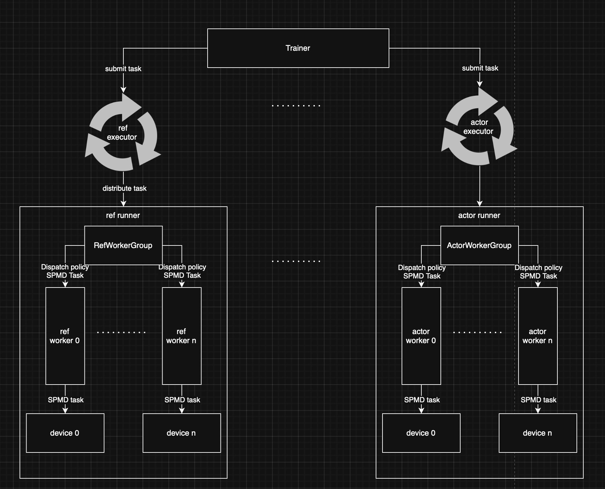

# 异步方案（v0.0.1）
## verl 原有方案
verl 的ppo实现流程可以通过以下流程图进行模拟

可以从图中看到，在verl的原始共卡方案中通过workgroup的抽象概念，将实际计算任务与数据流解耦。计算任务根据方法绑定的dispatch policy由分发发至worker执行，而数据流通过trainer类进行控制。该方案中trainer中调用的workergroup方法均为同步方法，因此无法进行异步RL训练。
## loop base方案

### 该方案相较于原方案进行了三大改动
1. 在每一个不同的资源池中新增loop类，该loop用于调度执行已注册任务。
2. 将执行单元抽象为runner，用于隔离调度loop与执行函数，runner中可以通过原有的worker group执行计算任务，也可以通过其他满足runner定义接口的类执行计算任务，如在rollout阶段可以直接调用推理引擎进行推理。
3. trainer从原有的同步接口调用改为异步接口调用，trainer中函数调用仅负责将计算任务注册至loop中，真正调度控制由loop进行。同时执行顺序由任务的future进行管理，避免在异步任务中出现复杂的同步调用。
### 此方案相较于原方案的优势
1. 通过异步接口调用实现异步RL训练，同时由于trainer类中只负责异步任务下发，因此调用逻辑与使用同步接口类似，无需在trainer类中考虑异步任务间的同步流程，极大减少自定义算法流程的适配难度。
2. 执行单元抽象为runner可以规范化接口，为后续潜在的backend新增预留规范。

需要注意的是，该方案默认一次rollout过程为原子任务无法被打断，因此如果想要适配patital rollout特性需在loop内新增一条wait queue并新增暂停与恢复rollout接口。
调用伪代码如下 

```
if __name__ == "__main__":
    runner_rollout = NonBlockSerialRunner()
    runner_actor = NonBlockSerialRunner()
    fut_add = None
    fut_multi = None
    for step in range(10):
        fut_rollout = runner_rollout.submit_sync(rollout.generate, args)
        fut_actor = runner_actor.submit_sync(actor.computer_logb, args, future=fut_rollout)
        runner_actor.submit_sync(actor.update_weight, fut_actor)
    print("主线程继续干别的……") 
    runner_rollout.shutdown()
    runner_actor.shutdown()
    print("进程已正常退出")
```
    